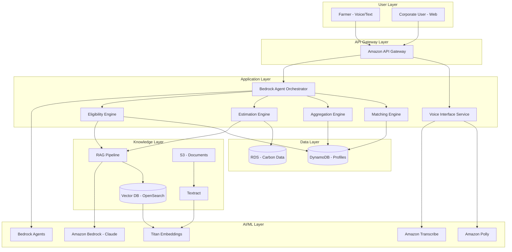
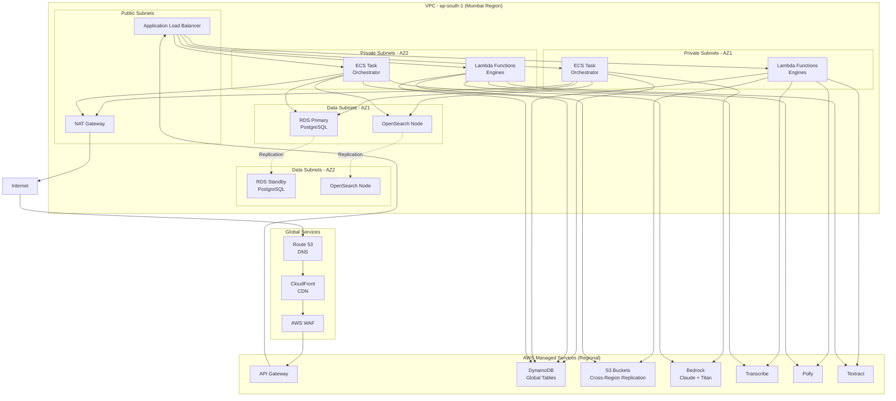

# Design Document: CarbonSakthi AI Platform

## Overview

CarbonSakthi is an AI-powered carbon credit access bridge that democratizes carbon market participation for small and marginal farmers in India. The platform leverages AWS AI services to create an intelligent, voice-first system that assesses farmer eligibility, estimates carbon credits, educates users, aggregates smallholders, and matches them with corporate buyers.

The architecture follows a modular, event-driven design with five core engines: Eligibility Engine, Estimation Engine, Aggregation Engine, Matching Engine, and Voice Interface. These components are orchestrated through Amazon Bedrock Agents, which coordinate multi-step workflows while maintaining context and state.

The system uses Retrieval-Augmented Generation (RAG) to ground AI reasoning in authoritative carbon methodology documents, ensuring accurate eligibility assessments and transparent calculations. Voice accessibility through Amazon Transcribe and Polly enables farmers with limited literacy to participate fully.

## Architecture

### High-Level Architecture



### Detailed AWS Architecture

```mermaid
graph TB
    subgraph "Client Layer"
        Mobile[Mobile App<br/>React Native]
        Web[Web Dashboard<br/>React]
    end
    
    subgraph "AWS Cloud"
        subgraph "Edge & Security"
            CF[CloudFront<br/>CDN]
            WAF[AWS WAF<br/>Web Firewall]
            Cognito[Amazon Cognito<br/>User Auth]
        end
        
        subgraph "API & Compute"
            APIGW[API Gateway<br/>REST + WebSocket]
            Lambda1[Lambda<br/>Voice Handler]
            Lambda2[Lambda<br/>Eligibility Engine]
            Lambda3[Lambda<br/>Estimation Engine]
            Lambda4[Lambda<br/>Aggregation Engine]
            Lambda5[Lambda<br/>Matching Engine]
            ECS[ECS Fargate<br/>Bedrock Orchestrator]
        end
        
        subgraph "AI/ML Services"
            Bedrock[Amazon Bedrock<br/>Claude 3 Sonnet]
            BedrockAgents[Bedrock Agents<br/>Workflow Orchestration]
            Transcribe[Amazon Transcribe<br/>Speech-to-Text]
            Polly[Amazon Polly<br/>Text-to-Speech]
            Textract[Amazon Textract<br/>Document Extraction]
            TitanEmbed[Titan Embeddings<br/>Text Vectorization]
        end
        
        subgraph "Data Storage"
            S3Docs[S3 Bucket<br/>Methodology PDFs]
            S3Audio[S3 Bucket<br/>Voice Recordings]
            DDB[DynamoDB<br/>Farmer Profiles<br/>Clusters<br/>Assessments]
            RDS[RDS PostgreSQL<br/>+ pgvector<br/>Carbon Coefficients]
            OpenSearch[OpenSearch<br/>Vector Search<br/>RAG Knowledge Base]
        end
        
        subgraph "Monitoring & Security"
            CW[CloudWatch<br/>Logs & Metrics]
            XRay[X-Ray<br/>Tracing]
            KMS[AWS KMS<br/>Encryption Keys]
            IAM[AWS IAM<br/>Access Control]
            Secrets[Secrets Manager<br/>API Keys]
        end
        
        subgraph "Event Processing"
            EventBridge[EventBridge<br/>Event Bus]
            SQS[SQS<br/>Offline Sync Queue]
            SNS[SNS<br/>Notifications]
        end
    end
    
    Mobile --> CF
    Web --> CF
    CF --> WAF
    WAF --> APIGW
    
    APIGW --> Cognito
    APIGW --> Lambda1
    APIGW --> Lambda2
    APIGW --> Lambda3
    APIGW --> Lambda4
    APIGW --> Lambda5
    APIGW --> ECS
    
    ECS --> BedrockAgents
    BedrockAgents --> Bedrock
    
    Lambda1 --> Transcribe
    Lambda1 --> Polly
    Lambda1 --> S3Audio
    
    Lambda2 --> Bedrock
    Lambda2 --> OpenSearch
    Lambda2 --> DDB
    
    Lambda3 --> RDS
    Lambda3 --> DDB
    
    Lambda4 --> DDB
    Lambda5 --> DDB
    
    S3Docs --> Textract
    Textract --> TitanEmbed
    TitanEmbed --> OpenSearch
    
    Lambda2 --> TitanEmbed
    Lambda3 --> TitanEmbed
    
    ECS --> EventBridge
    EventBridge --> SQS
    EventBridge --> SNS
    
    Lambda1 --> CW
    Lambda2 --> CW
    Lambda3 --> CW
    Lambda4 --> CW
    Lambda5 --> CW
    ECS --> CW
    
    ECS --> XRay
    Lambda2 --> XRay
    
    DDB --> KMS
    RDS --> KMS
    S3Docs --> KMS
    
    APIGW --> IAM
    Lambda2 --> Secrets
```



### AWS Service Mapping

**Frontend & Edge:**
- **CloudFront**: CDN for static assets, low-latency global access
- **AWS WAF**: Protection against common web exploits
- **Amazon Cognito**: User authentication and authorization (farmers, corporates, admins)

**API & Compute:**
- **API Gateway**: REST API for web/mobile, WebSocket for real-time updates
- **AWS Lambda**: Serverless functions for each engine (auto-scaling, pay-per-use)
- **ECS Fargate**: Container hosting for Bedrock Agent orchestrator (stateful workflows)

**AI/ML Services:**
- **Amazon Bedrock (Claude 3 Sonnet)**: LLM for reasoning, recommendations, explanations
- **Bedrock Agents**: Multi-step workflow orchestration with tool calling
- **Titan Embeddings**: Text-to-vector conversion for RAG pipeline
- **Amazon Transcribe**: Speech-to-text with Indic language support
- **Amazon Polly**: Text-to-speech with natural-sounding Indic voices
- **Amazon Textract**: PDF text extraction for methodology documents

**Data Storage:**
- **S3**: Document storage (methodology PDFs, voice recordings)
- **DynamoDB**: NoSQL for farmer profiles, clusters, assessments (fast, scalable)
- **RDS PostgreSQL + pgvector**: Relational data for carbon coefficients, historical data, vector storage
- **OpenSearch**: Vector search for RAG knowledge base, semantic similarity

**Event Processing:**
- **EventBridge**: Event-driven architecture for workflow coordination
- **SQS**: Queue for offline operations, async processing
- **SNS**: Notifications for farmers and corporates

**Monitoring & Security:**
- **CloudWatch**: Centralized logging, metrics, alarms
- **X-Ray**: Distributed tracing for debugging
- **AWS KMS**: Encryption key management for data at rest
- **AWS IAM**: Role-based access control
- **Secrets Manager**: Secure storage for API keys and credentials

### Deployment Architecture



### Infrastructure as Code Structure

**Terraform/CloudFormation Modules:**

1. **Networking Module**
   - VPC with public, private, and data subnets across 2 AZs
   - Internet Gateway, NAT Gateway
   - Security Groups for each tier
   - VPC Endpoints for AWS services (reduce NAT costs)

2. **Compute Module**
   - ECS Cluster with Fargate tasks
   - Lambda functions with appropriate IAM roles
   - Auto-scaling policies
   - Application Load Balancer

3. **Data Module**
   - DynamoDB tables with GSIs
   - RDS PostgreSQL with Multi-AZ
   - OpenSearch domain with 3 nodes
   - S3 buckets with lifecycle policies

4. **AI/ML Module**
   - Bedrock model access configuration
   - Transcribe custom vocabulary
   - Polly voice configuration
   - Textract document processing pipeline

5. **Security Module**
   - Cognito User Pools
   - IAM roles and policies
   - KMS keys for encryption
   - Secrets Manager secrets
   - WAF rules

6. **Monitoring Module**
   - CloudWatch dashboards
   - CloudWatch alarms
   - X-Ray tracing configuration
   - SNS topics for alerts

### Cost Optimization Strategy

**Compute:**
- Use Lambda for stateless, short-duration tasks (< 15 min)
- Use ECS Fargate Spot for non-critical workloads (70% cost savings)
- Enable auto-scaling based on CloudWatch metrics

**Storage:**
- S3 Intelligent-Tiering for documents
- DynamoDB On-Demand for unpredictable traffic
- RDS Reserved Instances for predictable baseline load

**AI/ML:**
- Batch Bedrock requests where possible
- Cache common RAG queries in ElastiCache
- Use Transcribe batch mode for non-real-time processing

**Data Transfer:**
- VPC Endpoints to avoid NAT Gateway costs
- CloudFront caching to reduce origin requests
- Compress payloads for low-bandwidth users

**Estimated Monthly Cost (1000 active farmers):**
- Compute (Lambda + ECS): $150
- Storage (S3 + DynamoDB + RDS): $200
- AI/ML (Bedrock + Transcribe + Polly): $300
- Networking (CloudFront + NAT): $100
- **Total: ~$750/month**

### Component Architecture

**1. Bedrock Agent Orchestrator**
- Coordinates multi-step agentic workflows
- Maintains conversation context and state
- Routes requests to appropriate engines
- Handles error recovery and fallbacks

**2. Voice Interface Service**
- Manages speech-to-text via Amazon Transcribe
- Supports Hindi, Tamil, Telugu, Bengali, Marathi
- Converts responses to speech via Amazon Polly
- Handles low-bandwidth audio compression

**3. Eligibility Engine**
- Validates farmer practices against carbon methodologies
- Uses RAG to retrieve relevant methodology sections
- Applies rule-based validation logic
- Returns eligibility status with reasoning

**4. Estimation Engine**
- Calculates carbon credits using coefficient-based formulas
- Retrieves emission factors from RDS
- Projects income based on carbon prices
- Provides transparent calculation breakdowns

**5. Aggregation Engine**
- Clusters farmers by geography and practice type
- Calculates aggregate carbon volumes
- Tracks cluster status and thresholds
- Manages cluster membership

**6. Matching Engine**
- Filters clusters based on corporate requirements
- Ranks matches by relevance
- Generates ESG impact metrics
- Provides geographic visualizations

**7. RAG Pipeline**
- Ingests methodology PDFs via Textract
- Generates embeddings via Titan
- Stores vectors in OpenSearch
- Retrieves relevant context for LLM reasoning

### Data Flow

**Farmer Assessment Flow:**
1. Farmer provides input (voice/text) → Voice Interface transcribes
2. Bedrock Agent initiates workflow → Collects all required fields
3. Eligibility Engine validates → RAG retrieves methodology rules
4. Estimation Engine calculates → Applies coefficients from RDS
5. Aggregation Engine assigns cluster → Updates cluster totals
6. Response generated → Voice Interface synthesizes speech
7. Results stored → DynamoDB (profile), RDS (carbon data)

**Corporate Matching Flow:**
1. Corporate user specifies requirements → API Gateway
2. Matching Engine queries clusters → Filters by criteria
3. ESG metrics calculated → Aggregates impact data
4. Results ranked and returned → Geographic visualization
5. Corporate user selects cluster → Matching recorded

### Technology Stack

**AI/ML Services:**
- Amazon Bedrock (Claude 3 Sonnet) - LLM reasoning
- Bedrock Agents - Workflow orchestration
- Titan Embeddings - Document vectorization
- Amazon Transcribe - Speech-to-text (Indic languages)
- Amazon Polly - Text-to-speech (Indic languages)

**Data Services:**
- DynamoDB - Farmer profiles, clusters, assessments
- RDS (PostgreSQL + pgvector) - Carbon coefficients, historical data
- OpenSearch - Vector search for RAG
- S3 - Methodology documents, audio files

**Compute & API:**
- AWS Lambda - Serverless functions for engines
- API Gateway - REST API endpoints
- App Runner / ECS - Container hosting for services
- EventBridge - Event-driven orchestration

**Security:**
- Amazon Cognito - User authentication
- AWS IAM - Role-based access control
- KMS - Encryption key management
- VPC - Network isolation

## Components and Interfaces

### 1. Bedrock Agent Orchestrator

**Purpose:** Coordinates multi-step agentic workflows for farmer assessment and corporate matching.

**Interface:**
```python
class BedrockAgentOrchestrator:
    def start_farmer_assessment(farmer_id: str, input_data: dict) -> AssessmentResult
    def continue_workflow(session_id: str, user_input: str) -> WorkflowResponse
    def get_workflow_state(session_id: str) -> WorkflowState
    def handle_workflow_error(session_id: str, error: Exception) -> ErrorResponse
```

**Workflow Steps:**
1. Collect farmer inputs (land, crops, practices)
2. Validate eligibility via Eligibility Engine
3. Estimate carbon credits via Estimation Engine
4. Generate recommendations via Bedrock LLM
5. Assign to cluster via Aggregation Engine
6. Return complete assessment

**State Management:**
- Session state stored in DynamoDB
- Intermediate results cached for resumption
- Timeout handling for long-running workflows

### 2. Voice Interface Service

**Purpose:** Provides voice-first accessibility for farmers with limited literacy.

**Interface:**
```python
class VoiceInterfaceService:
    def transcribe_audio(audio_bytes: bytes, language_code: str) -> str
    def synthesize_speech(text: str, language_code: str, voice_id: str) -> bytes
    def detect_language(audio_bytes: bytes) -> str
    def compress_audio_for_low_bandwidth(audio_bytes: bytes) -> bytes
```

**Supported Languages:**
- Hindi (hi-IN)
- Tamil (ta-IN)
- Telugu (te-IN)
- Bengali (bn-IN)
- Marathi (mr-IN)

**Low-Bandwidth Mode:**
- Reduce audio bitrate to 16 kbps
- Use shorter audio chunks
- Cache common phrases locally

### 3. Eligibility Engine

**Purpose:** Validates farmer practices against carbon methodology standards using RAG-based reasoning.

**Interface:**
```python
class EligibilityEngine:
    def assess_eligibility(farmer_profile: FarmerProfile) -> EligibilityResult
    def get_eligibility_reasoning(farmer_profile: FarmerProfile) -> str
    def suggest_improvements(farmer_profile: FarmerProfile) -> List[Recommendation]
    def validate_practice(practice: str, methodology: str) -> bool
```

**Validation Logic:**
1. Extract farmer practices from profile
2. Query RAG pipeline for relevant methodology sections
3. Use Bedrock LLM to reason about eligibility
4. Apply rule-based checks for minimum requirements
5. Return eligibility status with supporting evidence

**Eligibility Criteria (Examples):**
- Minimum land size: 0.5 acres
- Eligible practices: No-till farming, organic fertilizer, agroforestry, cover cropping
- Documentation: Location, crop type, practice duration

### 4. Estimation Engine

**Purpose:** Calculates potential carbon credits using standardized emission coefficients.

**Interface:**
```python
class EstimationEngine:
    def estimate_carbon_credits(farmer_profile: FarmerProfile) -> CarbonEstimate
    def calculate_income_projection(carbon_credits: float, price_per_ton: float) -> float
    def get_calculation_breakdown(farmer_profile: FarmerProfile) -> CalculationDetails
    def apply_carbon_formula(land_area: float, coefficients: dict) -> float
```

**Carbon Estimation Formula:**
```
Carbon_Credits (tCO₂e/year) = Land_Area × Crop_Coefficient × Practice_Factor × Soil_Factor

Where:
- Land_Area: Hectares
- Crop_Coefficient: Emission reduction per hectare for crop type (from RDS)
- Practice_Factor: Multiplier for sustainable practices (0.8 - 1.5)
- Soil_Factor: Regional soil carbon sequestration potential (0.9 - 1.2)
```

**Coefficient Sources:**
- IPCC emission factors
- Indian Council of Agricultural Research (ICAR) data
- Regional soil carbon databases

**Income Projection:**
```
Annual_Income = Carbon_Credits × Carbon_Price_Per_Ton
Carbon_Price_Per_Ton = $10 - $30 (simulated market price)
```

### 5. Aggregation Engine

**Purpose:** Clusters farmers to meet minimum carbon thresholds for market access.

**Interface:**
```python
class AggregationEngine:
    def assign_to_cluster(farmer_id: str, farmer_profile: FarmerProfile) -> Cluster
    def create_cluster(farmers: List[str], criteria: ClusterCriteria) -> Cluster
    def calculate_cluster_carbon(cluster_id: str) -> float
    def get_cluster_status(cluster_id: str) -> ClusterStatus
    def find_nearby_farmers(location: Location, radius_km: float) -> List[str]
```

**Clustering Algorithm:**
1. Group farmers by district/block (geographic proximity)
2. Filter by similar crop types and practices
3. Calculate aggregate carbon volume
4. Mark cluster as "market-ready" if total ≥ 100 tCO₂e/year
5. Assign cluster coordinator (FPO or lead farmer)

**Cluster Criteria:**
- Geographic radius: 50 km
- Minimum cluster size: 20 farmers
- Minimum carbon volume: 100 tCO₂e/year
- Practice similarity: ≥70% overlap

### 6. Matching Engine

**Purpose:** Connects farmer clusters with corporate carbon credit demand.

**Interface:**
```python
class MatchingEngine:
    def find_matches(corporate_requirements: CorporateRequirements) -> List[ClusterMatch]
    def rank_clusters(clusters: List[Cluster], requirements: CorporateRequirements) -> List[Cluster]
    def generate_esg_metrics(cluster_id: str) -> ESGMetrics
    def visualize_geographic_distribution(cluster_ids: List[str]) -> GeoVisualization
```

**Matching Criteria:**
- Carbon volume requirement
- Geographic preference (state/region)
- Practice type (organic, agroforestry, etc.)
- Certification level (simulated)

**ESG Metrics Generated:**
- Total tCO₂e offset
- Number of farmers supported
- Average farmer income increase
- Geographic diversity
- Sustainable practice adoption rate

### 7. RAG Pipeline

**Purpose:** Retrieves relevant methodology sections to ground AI reasoning in authoritative documents.

**Interface:**
```python
class RAGPipeline:
    def ingest_document(document_path: str, metadata: dict) -> str
    def query_knowledge_base(query: str, top_k: int) -> List[DocumentChunk]
    def generate_answer(query: str, context: List[DocumentChunk]) -> str
    def cite_sources(answer: str, context: List[DocumentChunk]) -> List[Citation]
```

**Document Ingestion Flow:**
1. Upload PDF to S3
2. Extract text via Textract
3. Chunk text into 512-token segments
4. Generate embeddings via Titan
5. Store vectors in OpenSearch with metadata

**Retrieval Flow:**
1. Convert query to embedding via Titan
2. Perform vector similarity search in OpenSearch
3. Retrieve top-k most relevant chunks (k=5)
4. Pass chunks as context to Bedrock LLM
5. Generate grounded response with citations

## Data Models

### Farmer Profile
```python
class FarmerProfile:
    farmer_id: str  # UUID
    name: str
    phone: str
    language_preference: str  # hi-IN, ta-IN, etc.
    location: Location
    land_size_acres: float
    crop_types: List[str]
    irrigation_method: str  # rainfed, drip, flood
    fertilizer_type: str  # organic, chemical, mixed
    tillage_method: str  # no-till, reduced-till, conventional
    agroforestry_present: bool
    practice_duration_years: int
    created_at: datetime
    updated_at: datetime
```

### Location
```python
class Location:
    state: str
    district: str
    block: str
    village: str
    latitude: float
    longitude: float
```

### Eligibility Result
```python
class EligibilityResult:
    farmer_id: str
    is_eligible: bool
    qualifying_practices: List[str]
    ineligibility_reasons: List[str]
    improvement_recommendations: List[Recommendation]
    methodology_citations: List[Citation]
    assessed_at: datetime
```

### Recommendation
```python
class Recommendation:
    practice: str
    description: str
    potential_carbon_increase: float  # tCO₂e/year
    implementation_difficulty: str  # easy, moderate, hard
    estimated_cost: float  # INR
```

### Carbon Estimate
```python
class CarbonEstimate:
    farmer_id: str
    annual_carbon_credits: float  # tCO₂e/year
    calculation_breakdown: CalculationDetails
    income_projection_min: float  # INR
    income_projection_max: float  # INR
    confidence_level: str  # high, medium, low
    estimated_at: datetime
```

### Calculation Details
```python
class CalculationDetails:
    land_area_hectares: float
    crop_coefficient: float
    practice_factor: float
    soil_factor: float
    formula_used: str
    coefficient_sources: List[str]
```

### Cluster
```python
class Cluster:
    cluster_id: str  # UUID
    name: str
    location: Location
    member_farmer_ids: List[str]
    total_carbon_credits: float  # tCO₂e/year
    status: str  # forming, market-ready, matched
    practice_types: List[str]
    coordinator_id: str  # FPO or lead farmer
    created_at: datetime
    updated_at: datetime
```

### Corporate Requirements
```python
class CorporateRequirements:
    company_id: str
    carbon_volume_min: float  # tCO₂e/year
    carbon_volume_max: float
    geographic_preference: List[str]  # states
    practice_types: List[str]
    budget_per_ton: float  # USD
```

### Cluster Match
```python
class ClusterMatch:
    cluster_id: str
    relevance_score: float  # 0-1
    total_carbon_credits: float
    farmer_count: int
    geographic_distribution: dict
    esg_metrics: ESGMetrics
```

### ESG Metrics
```python
class ESGMetrics:
    total_carbon_offset: float  # tCO₂e
    farmers_supported: int
    average_income_increase: float  # INR
    states_covered: int
    sustainable_practice_adoption_rate: float  # 0-1
    narrative: str  # Generated description
```

### Workflow State
```python
class WorkflowState:
    session_id: str
    farmer_id: str
    current_step: str  # collect, validate, estimate, recommend, cluster
    collected_data: dict
    intermediate_results: dict
    created_at: datetime
    updated_at: datetime
    expires_at: datetime
```

## Correctness Properties

*A property is a characteristic or behavior that should hold true across all valid executions of a system—essentially, a formal statement about what the system should do. Properties serve as the bridge between human-readable specifications and machine-verifiable correctness guarantees.*


### Core Properties

**Property 1: Complete Data Collection**
*For any* farmer data collection request, all required fields (land size, crop type, irrigation method, fertilizer usage, tillage method, agroforestry presence, location) should be present in the collected profile.
**Validates: Requirements 1.1**

**Property 2: Missing Field Detection**
*For any* incomplete farmer profile, the validation function should identify exactly the set of missing required fields.
**Validates: Requirements 1.3**

**Property 3: Farmer Profile Round-Trip**
*For any* complete farmer profile, storing to the database then retrieving should produce an equivalent profile with all fields preserved.
**Validates: Requirements 1.4**

**Property 4: Eligibility Assessment Invokes RAG**
*For any* farmer profile submitted for eligibility assessment, the system should query the RAG pipeline to retrieve relevant methodology sections.
**Validates: Requirements 2.1, 2.2**

**Property 5: Complete Eligibility Result Structure**
*For any* eligibility assessment, the result should include eligibility status, and if eligible then qualifying practices, or if ineligible then reasons and recommendations.
**Validates: Requirements 2.3, 2.4**

**Property 6: Carbon Estimation Formula Correctness**
*For any* eligible farmer profile with known coefficients, the calculated carbon credits should equal: Land_Area × Crop_Coefficient × Practice_Factor × Soil_Factor.
**Validates: Requirements 3.1, 3.2**

**Property 7: Income Projection Formula**
*For any* carbon credit estimate, the income projection should equal: Carbon_Credits × Carbon_Price_Per_Ton.
**Validates: Requirements 3.4**

**Property 8: Calculation Transparency**
*For any* carbon estimate, the result should include the complete formula, all coefficients used, their values, and their sources.
**Validates: Requirements 3.5, 12.1, 12.2**

**Property 9: Recommendations for Low Potential Farmers**
*For any* farmer assessed as ineligible or with carbon credits below threshold, the result should include non-empty improvement recommendations.
**Validates: Requirements 4.2**

**Property 10: Cluster Assignment**
*For any* assessed farmer, they should be assigned to exactly one cluster based on geographic location and practice similarity.
**Validates: Requirements 5.1**

**Property 11: Cluster Membership Criteria**
*For any* cluster, all member farmers should satisfy the clustering criteria: within geographic radius, similar crop types, and practice overlap ≥ 70%.
**Validates: Requirements 5.2**

**Property 12: Market-Ready Status Threshold**
*For any* cluster, if the total aggregate carbon credits ≥ 100 tCO₂e/year, the cluster status should be "market-ready".
**Validates: Requirements 5.3**

**Property 13: Cluster Aggregate Consistency**
*For any* cluster, the total carbon credits should equal the sum of all member farmers' carbon credits, and adding or removing a farmer should update the total correctly.
**Validates: Requirements 5.4, 5.5**

**Property 14: Corporate Match Filtering**
*For any* corporate requirements, all returned cluster matches should satisfy the filtering criteria: carbon volume within range, location matches preferences, and practice types match requirements.
**Validates: Requirements 6.1**

**Property 15: Complete Match Result Structure**
*For any* cluster match result, the response should include total tCO₂e, farmer count, geographic distribution, practice types, ESG metrics, and sustainability narrative.
**Validates: Requirements 6.2, 6.3**

**Property 16: Match Ranking Order**
*For any* set of cluster matches, clusters should be ordered by relevance score in descending order (highest relevance first).
**Validates: Requirements 6.5**

**Property 17: Voice Interaction Transcript Availability**
*For any* completed voice interaction, a text transcript of the conversation should be available for verification.
**Validates: Requirements 7.5**

**Property 18: Embedding Generation Pipeline**
*For any* extracted document text, embeddings should be generated and the resulting vectors should have consistent dimensionality matching the Titan model output.
**Validates: Requirements 8.2**

**Property 19: Vector Storage Round-Trip**
*For any* document chunk with embeddings, storing in the vector database then querying with the same embedding should retrieve the original chunk.
**Validates: Requirements 8.3**

**Property 20: RAG Citation Completeness**
*For any* RAG-generated response, citations should reference actual source documents with document IDs and page numbers.
**Validates: Requirements 8.5**

**Property 21: Workflow Step Sequencing**
*For any* farmer assessment workflow, steps should execute in the required sequence: collect inputs → validate eligibility → cross-reference standards → estimate carbon → suggest improvements → assign to cluster.
**Validates: Requirements 9.1**

**Property 22: Workflow Result Persistence**
*For any* completed workflow, the assessment result should be stored, and retrieving it should produce an equivalent result.
**Validates: Requirements 9.4**

**Property 23: Workflow State Resumption**
*For any* interrupted workflow, the intermediate state should be saved, and resuming should continue from the last completed step with preserved data.
**Validates: Requirements 9.5**

**Property 24: Low-Bandwidth Payload Compression**
*For any* data transmission in low-bandwidth mode, the payload size should be smaller than the same data in normal mode.
**Validates: Requirements 10.2**

**Property 25: Offline Operation Queueing**
*For any* operation attempted during offline mode, it should be added to a synchronization queue for later execution.
**Validates: Requirements 10.4**

**Property 26: Connectivity Restoration Sync**
*For any* queued operations, when connectivity is restored, all queued operations should be executed and removed from the queue.
**Validates: Requirements 10.5**

**Property 27: Role-Based Access Control**
*For any* data access attempt, the system should verify that the requesting user has the required role permissions before returning data.
**Validates: Requirements 11.4**

**Property 28: Calculation Breakdown Availability**
*For any* carbon estimate, a detailed breakdown by practice type should be available showing contribution of each practice to total credits.
**Validates: Requirements 12.3**

**Property 29: Coefficient Version History**
*For any* coefficient update, the previous version should be preserved in history, and recalculation with old coefficients should be possible.
**Validates: Requirements 12.4**

**Property 30: Complete ESG Report Structure**
*For any* ESG report request, the generated report should include total tCO₂e offset, number of farmers supported, geographic reach, and sustainability narratives.
**Validates: Requirements 13.1, 13.2**

**Property 31: ESG Report Format Compliance**
*For any* report export request, the output should be in the requested format (PDF or CSV) and parseable by standard tools.
**Validates: Requirements 13.4**

**Property 32: ESG Impact Aggregation Completeness**
*For any* ESG impact calculation, data from all matched clusters should be included in the aggregation.
**Validates: Requirements 13.5**

**Property 33: Demo Mode Data Isolation**
*For any* operation in demo mode, data should be read from and written to the demo dataset, and production data should remain unaffected.
**Validates: Requirements 15.1, 15.5**

**Property 34: Demo Mode Simulation**
*For any* query in demo mode (carbon prices, corporate demand), simulated data should be returned instead of real market data.
**Validates: Requirements 15.2**

**Property 35: Demo Mode Disclaimer**
*For any* response in demo mode, a clear disclaimer should be present indicating no real carbon certification or financial transactions occur.
**Validates: Requirements 15.4**

## Error Handling

### Error Categories

**1. Input Validation Errors**
- Invalid farmer data (negative land size, unknown crop types)
- Missing required fields
- Out-of-range values

**Error Response:**
```python
{
    "error_type": "ValidationError",
    "message": "Invalid input data",
    "details": {
        "field": "land_size_acres",
        "value": -5.0,
        "constraint": "must be positive"
    }
}
```

**2. External Service Errors**
- AWS service failures (Bedrock, Transcribe, Polly, Textract)
- Database connection failures
- Network timeouts

**Error Handling Strategy:**
- Retry with exponential backoff (3 attempts)
- Fallback to cached data when available
- Return graceful degradation response

**3. RAG Pipeline Errors**
- No relevant documents found
- Embedding generation failure
- Vector search timeout

**Error Handling Strategy:**
- Return generic methodology guidance
- Log retrieval failure for analysis
- Continue workflow with reduced context

**4. Workflow Orchestration Errors**
- Step execution failure
- State persistence failure
- Timeout exceeded

**Error Handling Strategy:**
- Save intermediate state
- Provide resumption token
- Notify user of partial completion

**5. Authorization Errors**
- Invalid credentials
- Insufficient permissions
- Expired session

**Error Response:**
```python
{
    "error_type": "AuthorizationError",
    "message": "Access denied",
    "required_role": "farmer",
    "user_role": "guest"
}
```

### Error Recovery Patterns

**Retry with Backoff:**
```python
def retry_with_backoff(func, max_attempts=3, base_delay=1.0):
    for attempt in range(max_attempts):
        try:
            return func()
        except RetryableError as e:
            if attempt == max_attempts - 1:
                raise
            delay = base_delay * (2 ** attempt)
            time.sleep(delay)
```

**Circuit Breaker:**
```python
class CircuitBreaker:
    def __init__(self, failure_threshold=5, timeout=60):
        self.failure_count = 0
        self.failure_threshold = failure_threshold
        self.timeout = timeout
        self.last_failure_time = None
        self.state = "closed"  # closed, open, half-open
    
    def call(self, func):
        if self.state == "open":
            if time.time() - self.last_failure_time > self.timeout:
                self.state = "half-open"
            else:
                raise CircuitOpenError()
        
        try:
            result = func()
            if self.state == "half-open":
                self.state = "closed"
                self.failure_count = 0
            return result
        except Exception as e:
            self.failure_count += 1
            self.last_failure_time = time.time()
            if self.failure_count >= self.failure_threshold:
                self.state = "open"
            raise
```

**Graceful Degradation:**
- If RAG fails: Use rule-based eligibility checks
- If voice fails: Fall back to text input
- If real-time calculation fails: Return cached estimates with timestamp

### Logging and Monitoring

**Log Levels:**
- ERROR: Service failures, data corruption, authorization violations
- WARN: Retries, fallbacks, degraded performance
- INFO: Workflow completions, user actions, state transitions
- DEBUG: Detailed execution traces, RAG retrievals, calculations

**Metrics to Track:**
- Eligibility assessment success rate
- Carbon estimation accuracy (compared to manual calculations)
- RAG retrieval relevance scores
- Voice transcription accuracy
- Workflow completion rate
- Average response time per component
- Error rate by category

## Testing Strategy

### Dual Testing Approach

The testing strategy employs both unit tests and property-based tests to ensure comprehensive coverage:

**Unit Tests:**
- Specific examples demonstrating correct behavior
- Edge cases (empty inputs, boundary values, special characters)
- Error conditions (invalid data, service failures, timeouts)
- Integration points between components

**Property-Based Tests:**
- Universal properties that hold for all inputs
- Comprehensive input coverage through randomization
- Minimum 100 iterations per property test
- Each test references its design document property

### Property-Based Testing Configuration

**Framework:** Use `hypothesis` for Python or `fast-check` for TypeScript/JavaScript

**Test Configuration:**
```python
# Python example with hypothesis
from hypothesis import given, settings
import hypothesis.strategies as st

@settings(max_examples=100)
@given(
    land_size=st.floats(min_value=0.5, max_value=5.0),
    crop_type=st.sampled_from(["rice", "wheat", "millet"]),
    practice_factor=st.floats(min_value=0.8, max_value=1.5)
)
def test_carbon_estimation_formula(land_size, crop_type, practice_factor):
    """
    Feature: carbon-credit-bridge, Property 6: Carbon Estimation Formula Correctness
    For any eligible farmer profile with known coefficients, the calculated carbon 
    credits should equal: Land_Area × Crop_Coefficient × Practice_Factor × Soil_Factor
    """
    # Test implementation
    pass
```

**Tag Format:**
Each property test must include a comment with:
- Feature name: `carbon-credit-bridge`
- Property number and title from design document
- Property statement

### Test Coverage by Component

**1. Eligibility Engine Tests**
- Unit: Specific farmer profiles (eligible/ineligible examples)
- Property: Property 4 (RAG invocation), Property 5 (result structure)

**2. Estimation Engine Tests**
- Unit: Known coefficient values producing expected results
- Property: Property 6 (formula correctness), Property 7 (income projection), Property 8 (transparency)

**3. Aggregation Engine Tests**
- Unit: Specific cluster formations
- Property: Property 10 (assignment), Property 11 (membership criteria), Property 12 (status threshold), Property 13 (aggregate consistency)

**4. Matching Engine Tests**
- Unit: Specific corporate requirements and expected matches
- Property: Property 14 (filtering), Property 15 (result structure), Property 16 (ranking order)

**5. Voice Interface Tests**
- Unit: Sample audio files in different languages
- Property: Property 17 (transcript availability)

**6. RAG Pipeline Tests**
- Unit: Known queries with expected document retrievals
- Property: Property 18 (embedding generation), Property 19 (storage round-trip), Property 20 (citation completeness)

**7. Workflow Orchestration Tests**
- Unit: Specific workflow scenarios (success, failure, interruption)
- Property: Property 21 (step sequencing), Property 22 (result persistence), Property 23 (state resumption)

**8. Data Persistence Tests**
- Unit: Specific data structures
- Property: Property 3 (farmer profile round-trip), Property 19 (vector storage round-trip), Property 22 (workflow result persistence)

**9. Security Tests**
- Unit: Specific authorization scenarios
- Property: Property 27 (role-based access control)

**10. Demo Mode Tests**
- Unit: Specific demo scenarios
- Property: Property 33 (data isolation), Property 34 (simulation), Property 35 (disclaimer)

### Integration Testing

**End-to-End Scenarios:**
1. Complete farmer assessment flow (voice input → eligibility → estimation → clustering)
2. Corporate matching flow (requirements → filtering → ESG report generation)
3. Document ingestion flow (PDF upload → extraction → embedding → retrieval)
4. Offline mode flow (data collection → queue → sync on reconnection)

**AWS Service Integration:**
- Mock AWS services in unit tests
- Use LocalStack for local integration testing
- Test against real AWS services in staging environment

### Performance Testing

**Load Testing:**
- Simulate 1000 concurrent farmer assessments
- Measure response time distribution
- Verify auto-scaling behavior

**Stress Testing:**
- Test RAG pipeline with large document corpus (1000+ PDFs)
- Test voice interface with poor audio quality
- Test low-bandwidth mode with 2G network simulation

### Accessibility Testing

**Voice Interface:**
- Test with native speakers of each supported language
- Verify transcription accuracy across accents and dialects
- Test text-to-speech naturalness and clarity

**Low-Bandwidth Mode:**
- Test with network throttling (2G, 3G speeds)
- Verify offline mode functionality
- Test sync behavior with intermittent connectivity

### Test Data

**Farmer Profiles:**
- Generate diverse profiles covering all crop types, practices, and regions
- Include edge cases (minimum land size, maximum land size, no practices)
- Include invalid data for error testing

**Methodology Documents:**
- Sample carbon methodology PDFs (IPCC guidelines, ICAR standards)
- Documents with various formats and structures
- Documents with tables, images, and complex layouts

**Carbon Coefficients:**
- Realistic coefficient ranges from research literature
- Regional variations for soil factors
- Seasonal variations for crop coefficients

### Continuous Testing

**CI/CD Pipeline:**
1. Run unit tests on every commit
2. Run property tests on pull requests
3. Run integration tests on staging deployment
4. Run performance tests weekly
5. Run accessibility tests before releases

**Test Metrics:**
- Code coverage target: 80%
- Property test pass rate: 100%
- Integration test pass rate: 95%
- Performance regression threshold: 10%
